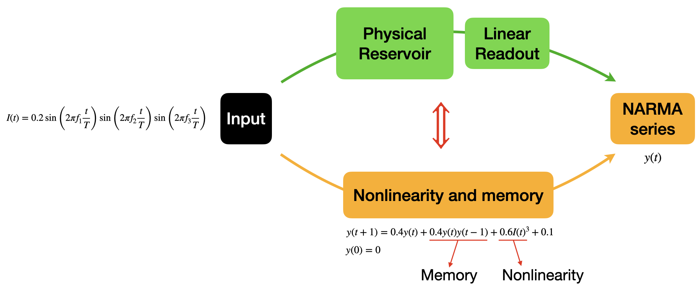
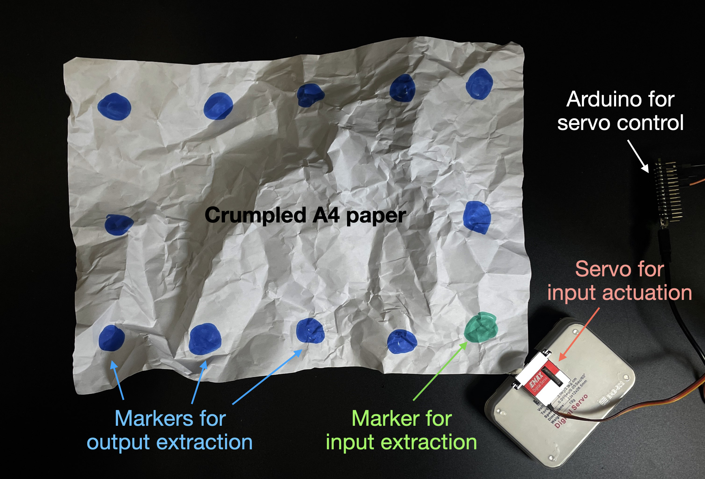

# Physical Reservoir Computing Examples

This repository contains examples of Physical Reservoir Computing (PRC) systems suitable for PHRESCO 2026 competition submissions. We are preparing multiple examples that will be updated gradually. All examples use the NARMA2 (Nonlinear Auto-Regressive Moving Average) test as a benchmark to evaluate the computational capabilities of the physical reservoirs.

## Overview: Physical Reservoir Computing Pipeline

The general pipeline for physical reservoir computing consists of:

1. **Input Signal**: A time-varying signal that drives the physical system. In PHRESCO we use a multi-frequency sinusoidal:
$I(t) = 0.2 \sin\left(\tfrac{2\pi f_{1} t}{T}\right)\sin\left(\tfrac{2\pi f_{2} t}{T}\right)\sin\left(\tfrac{2\pi f_{3} t}{T}\right)$,
where $f_{1}=2.11,\text{Hz}$, $f_{2}=3.73,\text{Hz}$, $f_{3}=4.33,\text{Hz}$, and the parameter $T$ controls the phase velocity.
2. **Target Output**: NARMA series generated from the input signal using a function. For NARMA2, the function is:
$y(t+1)=0.4y(t)+0.4y(t)y(t-1)+0.6I(t)^{3}+0.1$,
for NARMA-n, the function is:
$y(t+1)=\alpha y(t)+\beta y(t)!\left(\sum_{j=0}^{n-1} y(t-j)\right)+\gamma I(t-n+1)I(t)+\delta$,
where $\alpha=0.3$, $\beta=0.05$, $\gamma=1.5$, $\delta=0.1$. Those equations introduce memory and nonlinearity to the input signal.
4. **Physical Reservoir** 
5. **Linear Readout**: A trained linear layer that maps reservoir states to the target output.

If a physical reservoir passes the NARMA test—i.e., the linear readout can produce the target output when the reservoir is driven by the input signal—this means the reservoir-readout system processes the input signal in the same way as the NARMA equation. Since the NARMA equation introduces memory and nonlinearity, the reservoir-readout system must also exhibit the same memory and nonlinearity. Because the linear readout itself has no memory or nonlinearity, these must arise from the physical reservoir. Therefore, passing the NARMA test demonstrates that the physicial reservoir possesses memory and nonlinearity.

In PHRESCO, we require all participants to use the input signal described above. A reservoir qualifies for submission if it achieves a Normalised Mean Square Error (NMSE) below 20%.

The input signal and NARMA equation are adapted from Nakajima, Kohei, et al. "Information processing via physical soft body." Scientific reports 5.1 (2015): 10487.

## Example 1: Crumpled Paper Reservoir

### Overview

This example demonstrates one of the easiest possible physical reservoir computing systems that can qualify as a PHRESCO submission. 

**Experimental Setup:**
- **Reservoir**: A standard A4 paper, crumpled and then partially flattened, fixed at its centre point.
- **Input Actuation**: Servo motor providing angular displacement following the input signal (servo controlled by an Arduino running `Arduino_crumpled_paper.ino`). The input signal used in the NARMA2 test is the displacement of the green marker extracted from an iPhone camera recording (which guarantees synchronisation between the input and output).
- **Output Extraction**: 22 reservoir state variables (X and Y positions of the 11 blue markers) tracked by camera.

### Data Processing Pipeline

1. **Video Tracking** (`CP_video_processing.m`):
   - Extract input signal and reservoir states from video (60 fps)
   - Saves to MAT file with 60 Hz sampling rate

2. **NARMA Benchmark** (`CrumpledPaper.m`):
   - Loads tracking data
   - Generates NARMA target series from input
   - Trains linear readout using least squares (80% train, 20% test)
   - Evaluates Normalized Mean Square Error (NMSE)
   - Visualise the results

### Results

We tested the system at different frequency ratios (scaling factor T applied simulatneously to the three base input frequencies) from 1 to 4, with both NARMA2 and NARMA5 benchmarks:

Since the reservoir has achieved a NMSE below 20% in NARMA2 test at certian actuation frequencies, it is qualified for PHRESCO submission.
