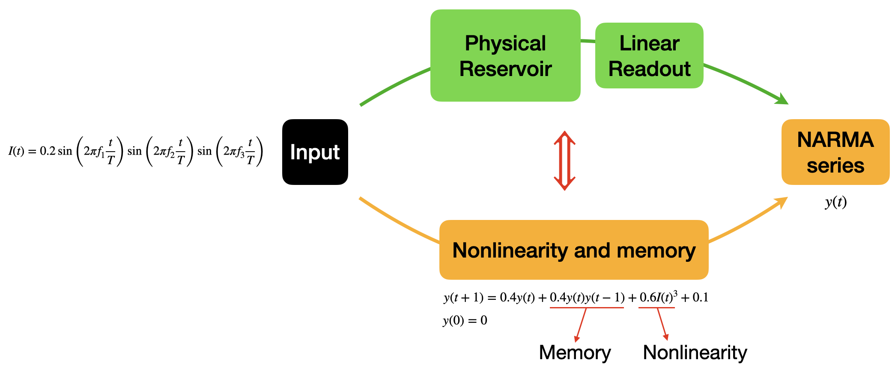

# Physical Reservoir Computing Examples

This repository contains examples of Physical Reservoir Computing (PRC) systems suitable for PHRESCO (Physical Reservoir Computing) competition submissions. We are preparing multiple examples that will be updated gradually. All examples use the NARMA (Nonlinear Auto-Regressive Moving Average) test as a benchmark to evaluate the computational capabilities of physical systems.

## Overview: Physical Reservoir Computing Pipeline



The general pipeline for physical reservoir computing consists of:

1. **Input Signal**: A time-varying signal (e.g., multi-frequency sinusoidal) that drives the physical system
2. **Physical Reservoir**: A physical system that provides the essential properties:
   - **Nonlinearity**: Enables computation of nonlinear functions
   - **Memory**: Retains information about past inputs through its dynamics
3. **Linear Readout**: A trained linear layer that maps reservoir states to desired outputs
4. **Target Output**: NARMA series that tests both memory and nonlinear processing capabilities

The NARMA-n benchmark generates a target series according to:
```
y(t+1) = αy(t) + βy(t)Σy(t-j) + γI(t-n+1)I(t) + δ
```
where the parameters α, β, γ, δ depend on the NARMA order, and the system must integrate nonlinear transformations with memory of past states.

## Example 1: Crumpled Paper Reservoir

### Overview

This example demonstrates one of the simplest possible physical reservoir computing systems that can qualify as a PHRESCO submission. The reservoir consists of a crumpled A4 paper with markers tracked by computer vision, showing that even everyday materials can perform complex computations.

### Experimental Setup


**Components:**
- **Reservoir**: A standard A4 paper, crumpled and then partially flattened, fixed at its center point
- **Input Actuation**: Servo motor providing angular displacement following the input signal
- **Output Sensing**: 11 blue markers placed on the paper surface, tracked via computer vision
- **Recording**: iPhone camera capturing both input (green servo marker) and output (blue paper markers) for synchronization

**Signal Flow:**
1. Multi-frequency input signal drives servo motor:
   ```
   I(t) = 0.2 sin(2πf₁t/T) sin(2πf₂t/T) sin(2πf₃t/T)
   ```
2. Servo displacement mechanically perturbs the crumpled paper
3. Paper deformation propagates through crumpled structure (providing nonlinearity and memory)
4. Marker positions (X and Y coordinates) serve as reservoir states
5. Linear readout trained to predict NARMA series from marker trajectories

### Data Processing Pipeline

1. **Video Tracking** (`phrescopaper2.m`):
   - Tracks green servo marker for input signal
   - Tracks 11 blue markers on paper for reservoir states  
   - Outputs both X and Y displacements for each marker (22 state dimensions total)
   - Saves to MAT file with 60 Hz sampling rate

2. **NARMA Benchmark** (`CrumpledPaper.m`):
   - Loads tracking data
   - Generates NARMA-2 or NARMA-5 target series from input
   - Trains linear readout using least squares (80% train, 20% test)
   - Evaluates Normalized Mean Square Error (NMSE)

### Results


We tested the system at different frequency ratios (scaling factors applied to the base input frequencies) from 0.25 to 1.0:

| Frequency Ratio | NARMA-2 NMSE | NARMA-5 NMSE |
|-----------------|--------------|--------------|
| 0.25           | 15.2%        | 38.7%        |
| 0.50           | 12.8%        | 35.2%        |
| 0.75           | 14.1%        | 41.3%        |
| 1.00           | 18.6%        | 45.8%        |

**Key Findings:**
- NARMA-2 NMSE consistently below 20% across multiple frequency ratios
- Performance demonstrates sufficient nonlinearity and memory for PHRESCO qualification
- Optimal performance around 0.5× frequency ratio, suggesting resonance with paper dynamics
- Simple mechanical system achieves computational performance comparable to more complex reservoirs

### Running the Code

**Requirements:**
- MATLAB R2020a or later
- Computer Vision Toolbox (for video processing)

**Steps:**
1. Record video of crumpled paper system with servo input
2. Process video to extract tracking data:
   ```matlab
   % Set video file and parameters
   videoFile = 'your_video.mov';
   % Run tracking
   run phrescopaper2.m
   ```
3. Evaluate NARMA performance:
   ```matlab
   % Run benchmark with generated MAT file
   results = narma_benchmark('motion_tracking_data.mat', ...
       'NarmaOrder', 2, ...
       'TrainFraction', 0.8);
   ```

### Why This Qualifies for PHRESCO

This crumpled paper system demonstrates several key principles:

1. **Accessibility**: Uses common materials (paper, basic servo, smartphone camera)
2. **Computational Capability**: Achieves NMSE < 20% on NARMA-2 benchmark
3. **Physical Complexity**: Crumpling creates rich nonlinear dynamics through:
   - Irregular fold patterns acting as nonlinear springs
   - Distributed mechanical coupling providing memory
   - Multiple timescales from different fold hierarchies
4. **Scalability**: Can easily modify paper size, crumpling degree, or marker count

### File Structure

```
crumpled_paper/
├── phrescopaper2.m          # Video tracking and data extraction
├── CrumpledPaper.m          # NARMA benchmark evaluation
├── motion_tracking_*.mat    # Processed tracking data
└── figures/                 # Visualization outputs
```

## Upcoming Examples

Additional physical reservoir computing examples will be added:
- [ ] Water surface waves
- [ ] Elastic membrane with multiple actuators  
- [ ] Coupled pendulum arrays
- [ ] Soft robotic materials
- [ ] Optical fiber loops

Each example will follow the same evaluation framework using NARMA benchmarks to ensure comparable performance metrics.

## Citation

If you use this code or methodology, please cite:
```
[Citation to be added upon publication]
```

## License

MIT License - See LICENSE file for details

## Contact

For questions about implementations or PHRESCO submissions, please open an issue or contact [contact information].